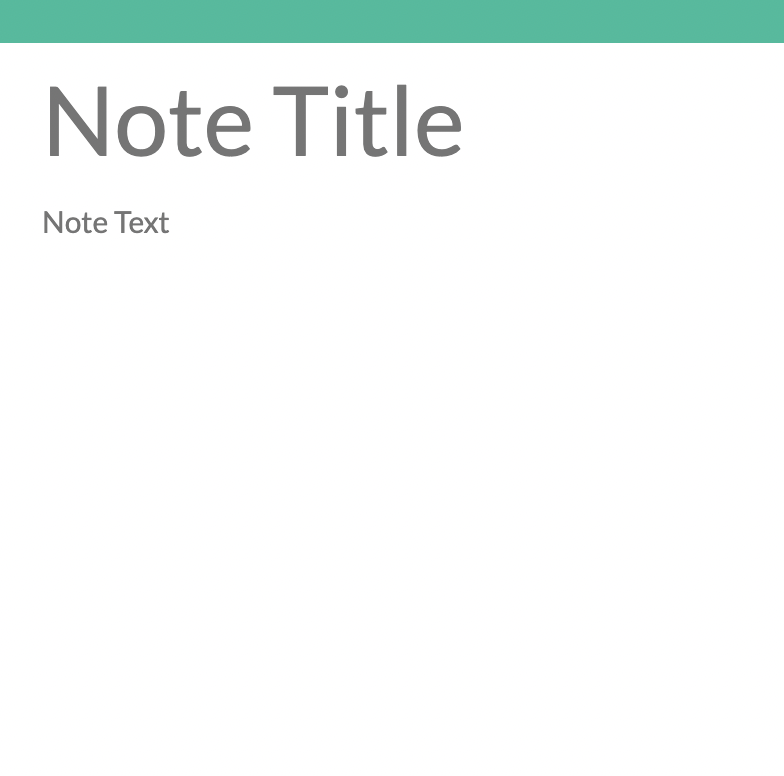

# *** Note-Taker ***
[GitHub Repository](https://github.com/scarfrae/Note-Taker)

[Deployed Application](https://note-taker-final-1.herokuapp.com/)

<!-- deployed application -->
## **Description** 📚

*note-taker* is an application that allows you to write notes for easier organization of tasks. Once you write the header and subtest for the note you have the option to save it. You can then delete the note if you are inclined.

## **Table of Contents** 📄

* Installation
* Usage
* License
* Contributing
* Testing
* Technology
* Questions

---

## **Installation** ⚙️

Visit my [repository](https://github.com/scarfrae/Note-Taker) to reference: any materials and my process in developing the web page. Visit my [Deployed Application](https://note-taker-final-1.herokuapp.com/) to use the webpage.

### **Usage** 💻
* Users can get started with writing a note by clicking the button displayed

* They can create a note via this portion of the page and the addition of text into the note title and note text

* They can save a note via this button

* They can delete a note via this button

### **License** 💳

MIT License

Copyright © 2022

Permission is hereby granted, free of charge, to any person obtaining a copy of this software and associated documentation files (the "Software"), to deal in the Software without restriction, including without limitation the rights to use, copy, modify, merge, publish, distribute, sublicense, and/or sell copies of the Software, and to permit persons to whom the Software is furnished to do so, subject to the following conditions:

The above copyright notice and this permission notice shall be included in all copies or substantial portions of the Software.

THE SOFTWARE IS PROVIDED "AS IS", WITHOUT WARRANTY OF ANY KIND, EXPRESS OR IMPLIED, INCLUDING BUT NOT LIMITED TO THE WARRANTIES OF MERCHANTABILITY, FITNESS FOR A PARTICULAR PURPOSE AND NONINFRINGEMENT. IN NO EVENT SHALL THE AUTHORS OR COPYRIGHT HOLDERS BE LIABLE FOR ANY CLAIM, DAMAGES OR OTHER LIABILITY, WHETHER IN AN ACTION OF CONTRACT, TORT OR OTHERWISE, ARISING FROM, OUT OF OR IN CONNECTION WITH THE SOFTWARE OR THE USE OR OTHER DEALINGS IN THE SOFTWARE.

### **Testing** 📝
All testing was done by the developing team.

### **Technology** 💡
* Express
* Heroku
* Javascript
* Html
* Css
* Node.js
* npm packages

### **Contact** ☎
* Sterling Cafrae **-** [Github](https://github.com/scarfrae)**,** [LinkedIn](https://www.linkedin.com/in/sterling-carfrae-a2a8151a5/)
...
***

